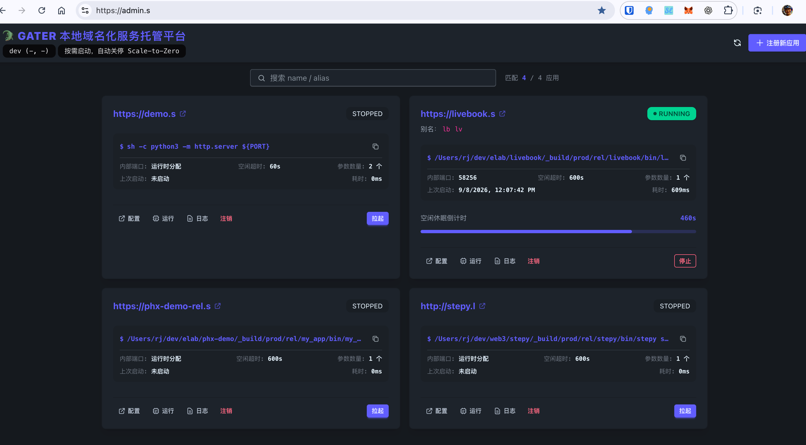

# Gater - macOS Web App Gateway

Gater 是一个面向 macOS 本地环境的按需启动反向代理。它会将已注册的应用映射到指定域名，例如 `demo.s`。当首次访问该域名时，才会启动对应应用；若应用空闲超过设定时长，则会自动停止，以减少不必要的后台资源占用。



## 核心机制

1. `gater` 启动时会创建 Store 和 Manager，并从 `~/.config/gater/store.yaml` 恢复已注册应用。恢复时仅创建内存对象，不会直接拉起子进程。
2. 应用可以通过 Web 控制台、API 或客户端进行注册。
3. 当请求访问 `demo.s` 时，代理会根据 Host 解析到对应应用；如果应用当前状态不是 `running`，则进入 `starting`。
4. 子进程使用独立进程组运行，标准输出和标准错误会同时写入 Gater 日志以及内存中的日志缓冲区。
5. 每次代理请求都会刷新 `LastActive`。后台监视器每 3 秒检查一次空闲时间；如果超过 `idle_timeout`，则向进程组发送 `SIGINT`。若 3 秒后进程仍未退出，则进一步发送 `SIGKILL`。
6. 当 Gater 接收到退出信号时，会取消全局 Context，停止所有应用，并关闭 HTTP 服务。

状态说明：

- `stopped`：未运行
- `starting`：已启动，但仍在等待端口就绪
- `running`：已通过端口探测，应用正常运行中
- `crashed`：启动失败、就绪超时，或运行过程中异常退出

## Demo app.yaml

示例文件位于：`lab/demo/app.yaml`

## 安装与使用

- 通过 `mise + GitHub` 安装到本地
- 参考 `lab/agent.plist` 安装为 `Launchd Agent` 服务

### 前置条件

- 通过 `dnsmasq` 定义泛域名访问 `*.s`，参考：https://github.com/cao7113/nix-mac/blob/main/net/dns/dnsmasq/default.nix
- 通过 `caddy` 配置本地 HTTPS 证书，并完成 HTTP/HTTPS 拦截，参考：https://github.com/cao7113/nix-mac/blob/main/net/caddy/Caddyfile

### 通过 mise + GitHub backend 安装

可通过 `mise` 的 GitHub backend 安装服务端：

```bash
mise use github:cao7113/gater
```

也可以将管理客户端配置为同一 release 的独立工具：

```toml
[tool_alias]
gater-client = "github:cao7113/gater"

[tools.gater-client]
version = "latest"
matching = "gater-client"
```

随后执行：

```bash
mise use gater-client
```

`mise` 默认会隐藏刚发布、尚未达到 `minimum_release_age` 的版本。如果需要在发布后立即安装，可以临时关闭该保护：

```bash
mise settings set minimum_release_age 0
mise use github:cao7113/gater
```

安装完成后，可恢复默认设置：

```bash
mise settings unset minimum_release_age
```

## 命令

项目包含两个命令：

- `gater`：后台服务
- `gater-client`：HTTP 管理客户端

本地构建：

```bash
go build -o bin/gater ./cmd/server
go build -o bin/gater-client ./cmd/client
```

查看版本：

```bash
bin/gater -version
bin/gater-client -version
```

## 发布构建

发布版本采用 GoReleaser。创建并推送一个 `v*` tag 后，GitHub Actions 将自动发布多平台产物：

```bash
git tag v0.1.0
git push origin v0.1.0
```
